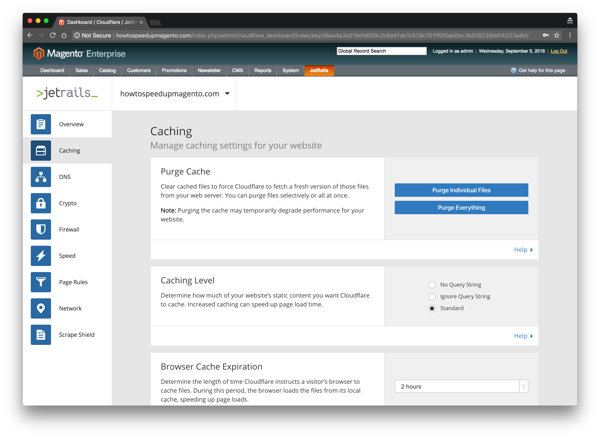

# Magento - Cloudflare
> Interact with popular Cloudflare features though Magento's backend portal

	

## Documentation

A user guide can be found in the [docs](docs) folder. The information there goes over all the features that the extension offers. It also takes you through the installation and configuration process of setting this extension up.

## Build System

This extension uses __GULP__ for it's build system.  Gulp is a package that can be easily downloaded using __NPM__.  Once this repository is cloned, run `npm install gulp -g` followed by `npm install` to install Gulp and all Gulp plugins used within this build system.  Please refer to the following table for a description of some useful gulp build commands. A typical gulp command takes the following form: `gulp <task>`.

| Task       | Description                                                                                                                                                                                     |
|------------|-------------------------------------------------------------------------------------------------------------------------------------------------------------------------------------------------|
| `watch`  | Automatically compiles, combines, and minifies JS and SCSS before deploying the code into the staging environment.                                                                                           |
| `package`  | Packages extension into _TGZ_ archive inside _dist_ folder. |                                                                                             |

## Docker Environment

This project comes with a [docker-compose.yml](docker-compose.yml) file, which can be used to spin up a Magento CE 1.x environment. In order to use docker, please make sure you have **Docker** and **Docker Compose** installed. For information about configuring this docker environment, please refer to it's Github repository which can be found [here](https://github.com/jetrails/docker-magento).
